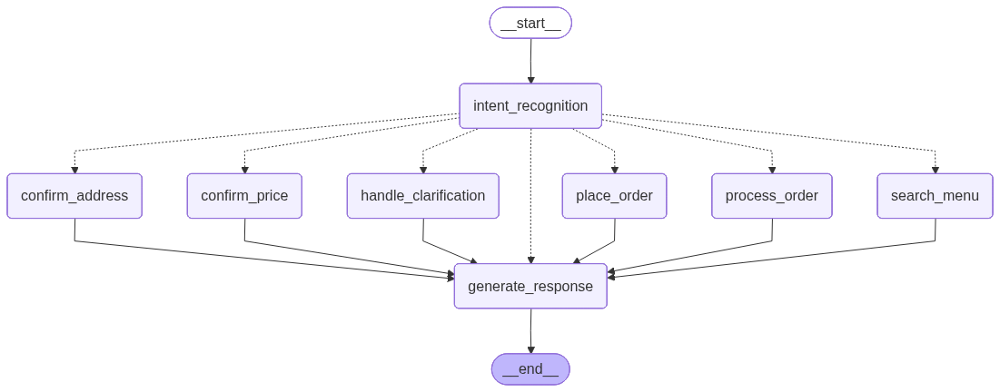

# AI 餐厅点餐代理 🍜

一个实验性的“AI 餐厅代理”，结合了向量意图识别、LangGraph 工作流管理以及 RAG 风格检索，用于驱动自动化的点餐对话。

## 🧩 架构

- **基于 LangGraph 的状态机**  
  对话建模为 `StateGraph`（参见 `order_agent.py`）。  
  每个节点表示一个逻辑步骤（意图识别、菜单搜索、订单处理、价格/地址确认、生成回复等），边根据意图或对话阶段进行路由。

- **AI 代理 / LLM 集成**  
  - `llm_chater.SimpleLLM` 封装了 HuggingFace 的因果模型管道，提供上下文感知聊天、意图分析和临时提取辅助。  
  - 当向量意图识别器不确定时，代理可以升级为使用 LLM（见 `llm_intent_recognition()` 和 `intent_recognition_node`）。

- **RAG & 向量搜索**  
  - 菜单项在向量存储 (`vector_store`) 中建立索引，以进行语义搜索。  
  - 当用户提到的菜名不完全匹配时，代理会使用向量数据库解析最接近的项。  
  - 同一向量索引也支持意图识别器（见 `IntentRecognizer.py`）。

- **意图识别**  
  - 使用向量+轻量级分类器识别 `order`、`search`、`confirm_price` 等意图。  
  - `intention/intentions_enum.py` 枚举定义了所有可能的意图，并包含辅助函数（如 `from_str`）。  
  - 低置信度情况下会自动触发澄清节点或 LLM 回退。

### Agent工作流程图



上图展示了完整的一轮对话流程：
1. **intent_recognition** 分析用户输入并路由到相应处理节点
2. **process_order**、**search_menu**、**confirm_price** 等节点处理特定意图
3. **handle_clarification** 管理低置信度情况
4. 所有路径汇聚在 **generate_response** 生成最终回复
5. 生成回复后工作流结束

## 📁 关键组件

| 模块/文件夹 | 目的 |
|--------------|---------|
| `order_agent.py` | 核心代理逻辑与状态图 |
| `menu.py` | 菜单数据模型与价格查询 |
| `Customer`、`order` 类 | 订单/客户辅助 |
| `IntentRecognizer.py` | 基于向量的意图分类器 |
| `NLPEntityExtractor.py` | 提取菜名和数量 |
| `FAISSMenuStore.py` | 菜单项向量索引 |
| `llm_chater.py` | 聊天与意图分析的 LLM 封装 |
| `stage_enum.py` | 对话阶段枚举 |
| `intention/intentions_enum.py` | 意图定义 |

## ⚙️ 使用场景

1. **用户说话**（例如 “我要一份麻婆豆腐”）。  
2. 代理调用 `intent_recognizer.recognize()`。  
3. 图路由至 `process_order_node` 或 `search_menu_node`。  
4. 若为点餐，则提取实体；执行菜单查找（可能使用向量数据库）。  
5. 更新订单状态；阶段机可能转至价格/地址确认。  
6. 回复由 `_generate_stage_response()` 或必要时由 LLM 生成。

## 🧠 AI 中心特性

- **混合意图处理** – 向量检索加 LLM 兜底。  
- **RAG 风格菜单查找** – 对模糊菜名进行语义相似度检索。  
- **上下文感知 LLM 对话** 使用 `SimpleLLM`（保存有限历史）。  
- **低置信度自动提问澄清**。

## 📦 安装与依赖

>（假设使用 Anaconda/venv 管理环境；安装 Transformers、LangChain、PyTorch 等）

```sh
# 创建/激活环境
pip install -r requirements.txt
```

## 🛠 扩展项目

- 在 `intentions_enum.py` 添加新意图并更新路由。  
- 替换或重新训练向量意图识别器。  
- 更换 LLM 后端（例如使用 GPT‑4/其他 HF 模型）。  
- 将真实下单 API 替换为当前的 `print()`/`input()` 存根。

---

> 本项目展示了如何使用 LangGraph、RAG 和向量意图识别等现代技术构建 AI 驱动的对话流程，用于实际任务如餐厅点餐。欢迎 fork、试验与扩展！